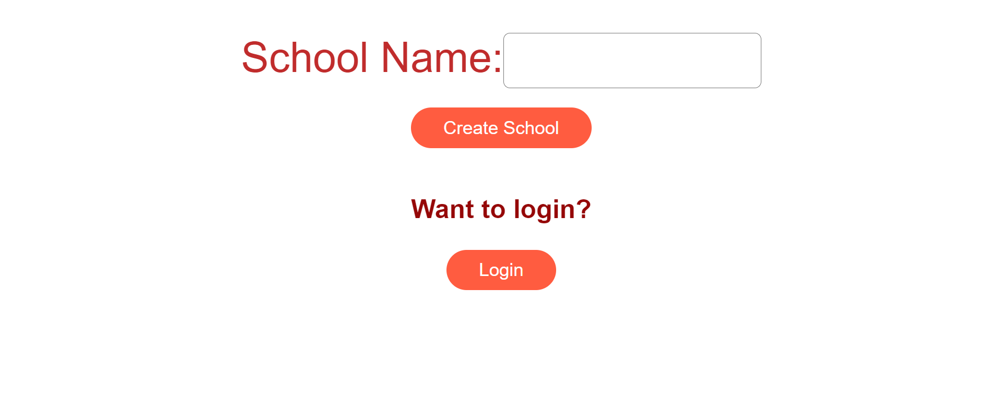
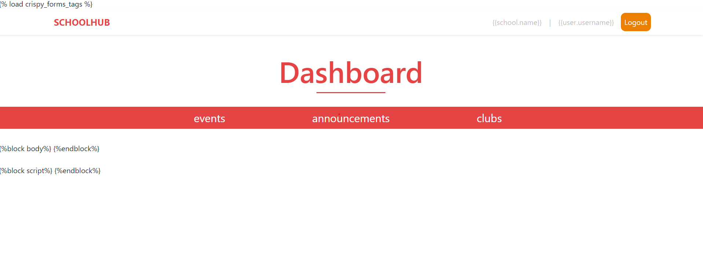

# SchoolHub website

During the MenloHack 24 hour Hackathon A group of 4 friends and I were tasked to build something to better human life during the pandemic. When taking that into the perspective of our lives we all agreed that there was major segregation between in-person and virtual TDSB students, so much to the point where even announcements from a direct school would not reach online students. To fix this issue We decided to make a more school-specific website to fill in all the important tasks the current Bright Space website was not fulfilling for all virtual students. 

For this website, we have two roles which are teachers and students, who both get their look onto the website. Some of the features available on the website are to create a new club, post announcements, and take about events. We have also taught about adding a blog section where students can communicate and talk to each other to help better the loneliness of the pandemic. The way we differentiate between a student and a teacher is by the Gmail address provided. Furthermore, we have a login section where students or teachers can log to their specific high school under their specific accounts.

### Images of Website

### Login Screen

### Dashboard

